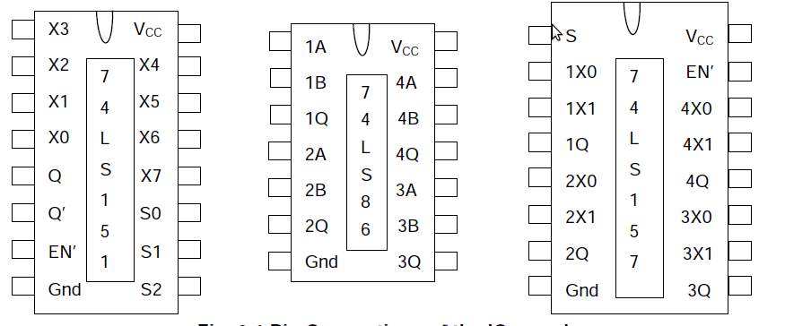
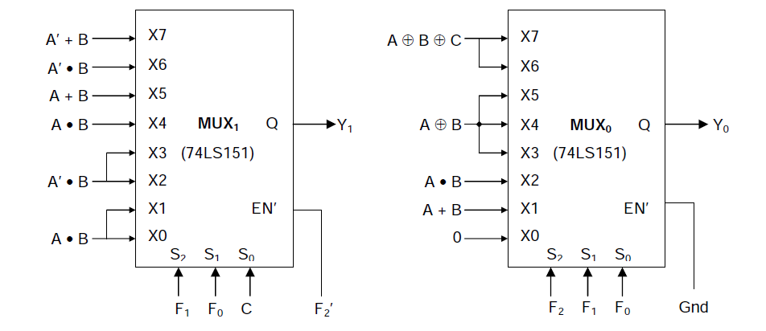

**Programmable 1-bit ALU**

In this experiment, an Arithmetic and Logic Unit (ALU) capable of performing 8 Arithmetic/Logic functions on 1-bit operands, will be designed, assembled and tested. The circuit will consist of two 8-input multiplexers (74LS151), one quad 2-input multiplexer (74LS157) and one quad 2-input XOR gate (74LS86), all belonging to the TTL family.

**ALU Function Table**

|F2F1F0 | ALU Function | Y1   | Y0 |
|-------|--------------|------|----|
|000    | 0(Zero)      | -    |	0  |
|001    | A OR B       | -    | A+B|
|010 	| A AND B      | -    | A.B|
|011    | A EXOR B     | -    |	A^B|
|100 	| A PLUS B     | Carry|	Sum|
|101    | A MINUS B    |Borrow| Difference|
|110    |A PLUS B PLUS C|Carry|	Sum|
|111    |A MINUS B MINUS C|Borrow|Difference|

**PIN connections for the IC's** 

The final ALU output bits Y0 and Y1 will be generated by the two 8-input multiplexers – referred to as MUX0 and MUX1 respectively(both 74LS157). MUX0 is always enabled, while MUX1 is enabled only when F2 = 1, i.e. for Arithmetic functions only. This is because Y1 is required only to provide the CARRY/BORROW output for Arithmetic functions. 

The two 8-input multiplexers MUX0 and MUX1 require 16 inputs, they involve only 6 distinct Boolean functions of A, B, C – A • B, A’ • B, A + B, A’ + B, A ⊕ B and A ⊕ B ⊕ C. The first four terms are realised by four 2-input multiplexers.   
