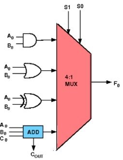

### Arithmetic Logic Unit (ALU) Fundamentals

An Arithmetic Logic Unit (ALU) is a fundamental digital circuit that performs arithmetic and logical operations on binary data. It serves as the computational core of processors, microcontrollers, and digital systems. The ALU receives data operands and control signals, then produces results based on the selected operation.

#### Key Components of an ALU

- **Data Inputs**: Operands A and B that will be processed
- **Function Select Lines**: Control signals that determine which operation to perform
- **Output**: Result of the selected arithmetic or logical operation
- **Status Flags**: Additional outputs indicating conditions like carry, zero, or overflow

### Programmable 1-bit ALU Design

_Figure 1: Programmable 1-bit ALU circuit showing multiplexer-based function selection and arithmetic/logic components. Reference: Circuit implementation_

In this experiment, we design a programmable 1-bit ALU capable of performing 4 different arithmetic and logic functions on 1-bit operands. The circuit consists of carefully selected components that work together to provide multiple computational capabilities.

#### Circuit Components

- **1 4-input Multiplexer**: Selects which operation result to output based on control signals
- **1 Full Adder**: Performs binary addition with carry handling
- **1 2-input AND Gate**: Executes logical AND operation
- **1 2-input OR Gate**: Executes logical OR operation
- **1 2-input XOR Gate**: Executes logical exclusive OR operation

#### ALU Function Table

| S₁  | S₀  | ALU Function | Carry Output | Result Description |
| --- | --- | ------------ | ------------ | ------------------ |
| 0   | 0   | Addition     | Carry        | (A + B) mod 2      |
| 0   | 1   | AND          | -            | A · B              |
| 1   | 0   | OR           | -            | A + B              |
| 1   | 1   | XOR          | -            | A ⊕ B              |

#### Understanding Multiplexer Input Selection

The 4-to-1 multiplexer is the key component that enables the ALU's programmable functionality. Each multiplexer input corresponds to a specific operation:

- **I₀ (Input 0)**: Connected to the Full Adder output - selected when S₁S₀ = 00 (Addition)
- **I₁ (Input 1)**: Connected to the AND gate output - selected when S₁S₀ = 01 (AND operation)
- **I₂ (Input 2)**: Connected to the OR gate output - selected when S₁S₀ = 10 (OR operation)
- **I₃ (Input 3)**: Connected to the XOR gate output - selected when S₁S₀ = 11 (XOR operation)

**How Selection Works**: When you set the control signals S₁S₀ to a specific binary combination, the multiplexer automatically routes the corresponding input to the output. For example, setting S₁S₀ = 01 tells the multiplexer to select input I₁, which carries the result of the AND operation between inputs A and B.

**Visual Identification**: In the demonstration, each multiplexer input is clearly labeled with both its input number (I₀, I₁, I₂, I₃) and the corresponding control signal combination (00, 01, 10, 11). This helps you easily understand which operation will be performed for any given S₁S₀ setting.

#### Logic Equations

**Function Selection**: The multiplexer selects the output based on S₁S₀:

- **Addition (S₁S₀ = 00)**: Sum = A ⊕ B ⊕ Cin, Carry = AB + BCin + CinA
- **AND Operation (S₁S₀ = 01)**: Result = A · B
- **OR Operation (S₁S₀ = 10)**: Result = A + B
- **XOR Operation (S₁S₀ = 11)**: Result = A ⊕ B

#### Key Features

- **Programmable Operation**: Function select lines S₁S₀ determine which operation is performed
- **Multiple Data Paths**: Separate circuits for arithmetic and logical operations
- **Multiplexed Output**: Single output line carries result of selected operation
- **Carry Generation**: Addition mode produces both sum and carry outputs
- **Compact Design**: Efficient use of basic logic gates and multiplexer

#### Truth Tables for 1-bit ALU Operations

**Addition Mode (S₁S₀ = 00):**

|  A  |  B  | Cin | Sum | Carry |
| :-: | :-: | :-: | :-: | :---: |
|  0  |  0  |  0  |  0  |   0   |
|  0  |  1  |  0  |  1  |   0   |
|  1  |  0  |  0  |  1  |   0   |
|  1  |  1  |  0  |  0  |   1   |
|  0  |  0  |  1  |  1  |   0   |
|  0  |  1  |  1  |  0  |   1   |
|  1  |  0  |  1  |  0  |   1   |
|  1  |  1  |  1  |  1  |   1   |

**Logic Operations (S₁S₀ = 01, 10, 11):**

|  A  |  B  | AND | OR  | XOR |
| :-: | :-: | :-: | :-: | :-: |
|  0  |  0  |  0  |  0  |  0  |
|  0  |  1  |  0  |  1  |  1  |
|  1  |  0  |  0  |  1  |  1  |
|  1  |  1  |  1  |  1  |  0  |

#### Instruction Set Architecture Concepts

**Function Select Lines (S₁S₀)**: These control signals act as a simple instruction set that determines ALU behavior:

1. **Instruction Encoding**: Each S₁S₀ combination represents a different operation
2. **Program Storage**: These instructions are typically stored in ROM for repeated use
3. **Register Operations**: Inputs A and B are usually sourced from internal registers
4. **Microcontroller Foundation**: This ALU design forms the basis for more complex processor arithmetic units

#### Applications

- **Educational Demonstrations**: Understanding fundamental processor operations
- **Microcontroller Design**: Building blocks for simple processing units
- **Digital System Design**: Component in larger computational circuits
- **Processor Architecture**: Foundation for understanding CPU arithmetic units
- **Embedded Systems**: Simple arithmetic and logical operations in control systems

#### Advantages and Limitations

**Advantages:**

- Simple and educational design
- Clear demonstration of ALU principles
- Multiple operations in single circuit
- Foundation for larger ALU designs

**Limitations:**

- Only 1-bit operations
- Limited function set (4 operations)
- No status flag generation
- Cannot handle complex arithmetic (multiplication, division)

#### Scaling to Multi-bit ALUs

This 1-bit ALU can be expanded to handle multi-bit operations by:

1. **Cascading Multiple 1-bit ALUs**: Connect carry outputs to carry inputs
2. **Shared Control Lines**: Use same S₁S₀ signals for all bit positions
3. **Status Flag Generation**: Add circuits for zero detection, overflow, etc.
4. **Enhanced Function Set**: Include more arithmetic and logical operations
