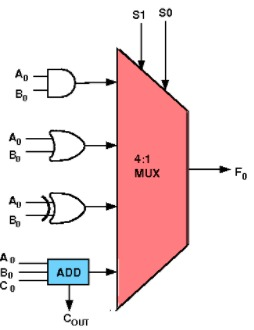

**Programmable 1-bit ALU**

In this experiment, an Arithmetic and Logic Unit (ALU) capable of performing 4 Arithmetic/Logic functions on 1-bit operands, will be designed, assembled and tested. The circuit will consist of one 4-input multiplexer, one full adder, one 2 input AND gate, one 2 input OR gate and one 2-input XOR gate, all belonging to the TTL family.

**ALU Function Table**

|S1S0 | ALU Function| Carry| output  |
|-----|-------------|------|---------|
|00   | sum         | carry| (A+B)%2 |
|01   | A OR B      | -    |  A | B  |
|10   | A AND B     | -    |  A & B  |
|11   | A EXOR B    | -    |  A ^ B  |

Some important points to note are:
1. S1 and S0 are select lines that select which operation should be performed by the ALU.These selection line combined with input arguments and the functions form an Instruction Set.
2. These instruction are useful in creating programs and are normally stored in ROM unit as they are required to be used often.
3. Inputs A,B are usually stored in internal registers. These along with other special registers constitute the registers of a microcontroller.

